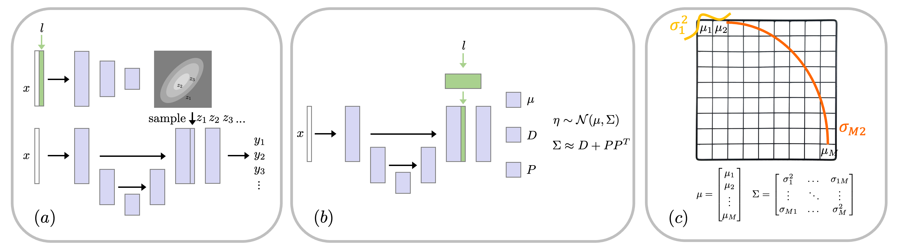

# That Label's Got Style: Handling Label Style Bias for Uncertain Image Segmentation

Kilian Zepf, Eike Petersen, Jes Frellsen, Aasa Feragen, ICLR 2023

[[Paper on OpenReview]](https://openreview.net/pdf?id=wZ2SVhOTzBX)


This repository contains the models presented in the paper as well as a new datasets for studying varying label styles in uncertain image segmentation. The code is based on PyTorch. 



Figure: Schematic model architectures (adapted from Kohl et al. (2018) and Monteiro et al. (2020)) of the prob. U-net (a) and SSN (b) during inference time. Our modifications to the models are shown in green. (c) illustrates a normal distribution over the logit pixel space.

## Dependencies

All dependencies are listed the the file `requirements.txt`. You can set-up a new virtual environment and install dependencies with 

```
pip install -r requirements.txt
```

## Data

Download the datasets by running the following commands from the home directory

```
python data/phc_data/download_phc_dataset.py 
python data/isic3/download_isic3.py 
```

This will downoad the isic and PhC-U373 datasets and unpack them to `./data/`.

## Train (conditioned) uncertain segmentation models

To train all 4 models on both datasets (=8 models total), with pre-tuned hyperparameters, execute the script:

```
./scripts/train.sh
```

## Test the models and generate figures of the paper

Lorem Ipsum

## Citation
If our method is helpful for your own research, please consider citing our ICLR 2023 paper:
```
@inproceedings{zepf2023label,
  title={That Label's got Style: Handling Label Style Bias for Uncertain Image Segmentation},
  author={Zepf, Kilian and Petersen, Eike and Frellsen, Jes and Feragen, Aasa},
  booktitle={The Eleventh International Conference on Learning Representations},
  year={2023}
}
```